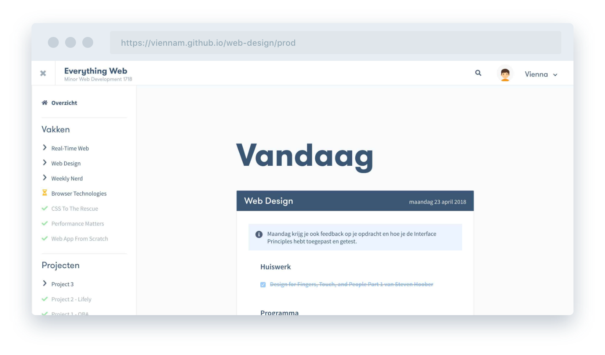
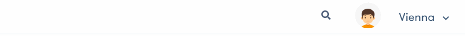
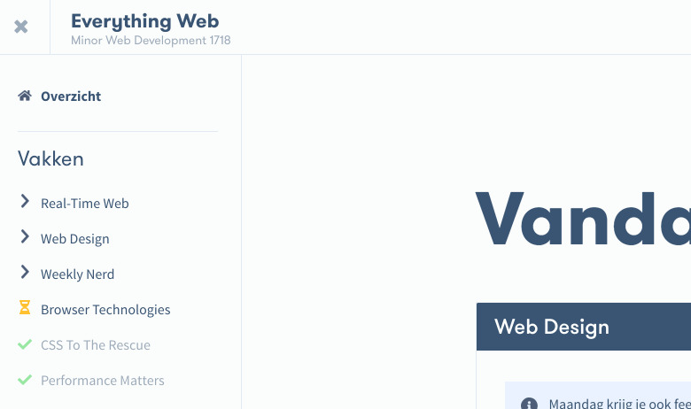
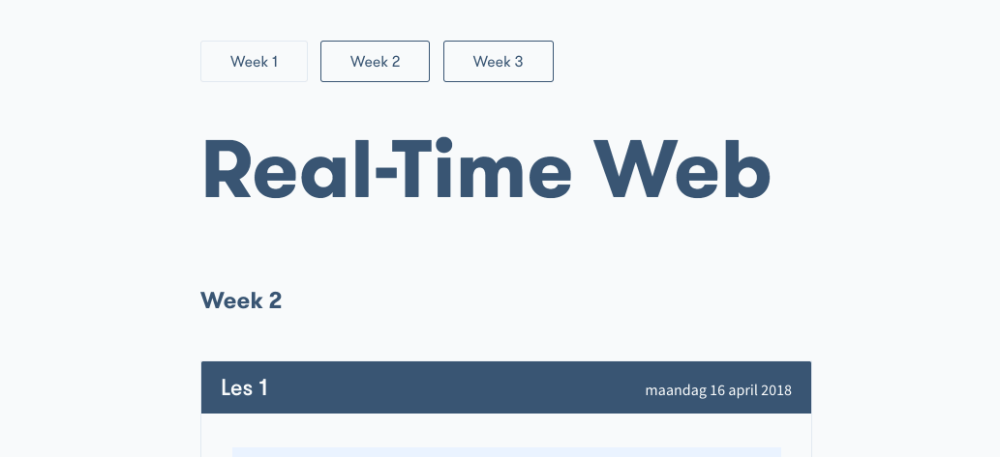
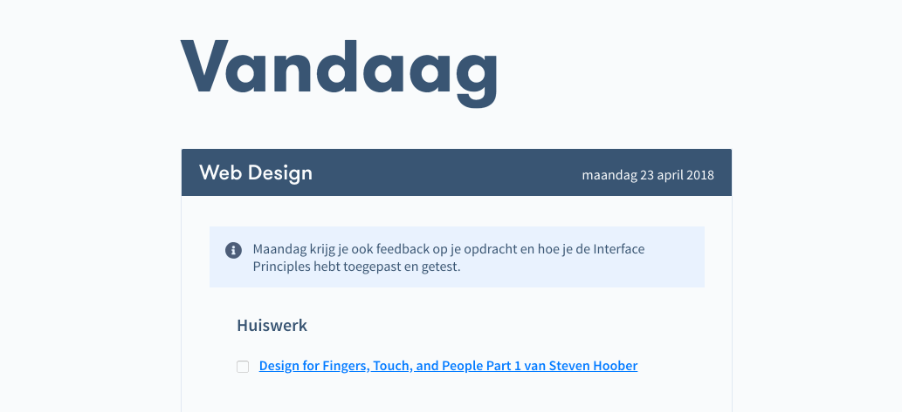
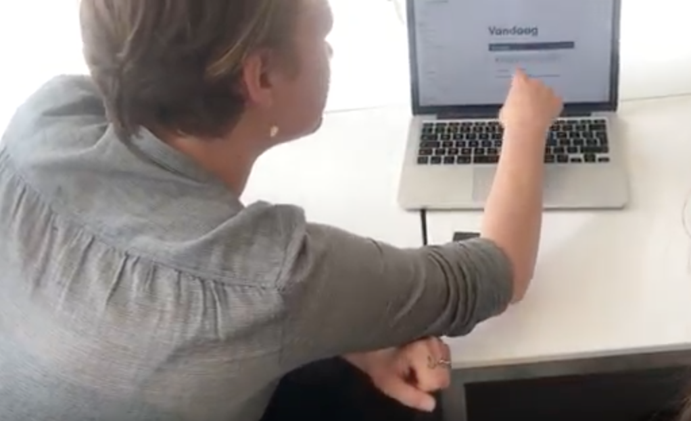

# Web Design

De opdracht voor het vak Web Design is om een ontwerp te maken, waarin [User Interface Principles](http://bokardo.com/principles-of-user-interface-design/) zijn toegepast en User needs worden bahaald.

De case die ik heb gekozen is een leeromgeving voor de minor. 

Demo: [http://viennam.github.io/web-design/prod](http://viennam.github.io/web-design/prod)

## Content
Wat heb ik allemaal (nodig)?

## User Scenario's

### Marie
Marie volgt de minor web development en wil in één oogopslag een duidelijk overzicht van het juiste lesmateriaal, zodat ze geen lange lappen tekst hoeft door te lezen om bijvoorbeeld een document te vinden die zij zoekt.

**Scenaro:** Marie navigeert naar het vak waarvan zij de slides nog eens wil doorlezen. Ze selecteert de week waar de slides te vinden zijn. Ze scrollt naar beneden om de juiste les te vinden. Ondertussen wordt er een mededeling gedaan door een docent en moet haar aandacht verleggen naar haar doventolk. Wanneer de mededeling is geweest gaat haar aandacht weer naar haar scherm. Ze weet precies waar ze is gebleven en kan de presenatie vinden die zij zocht. Mocht het zo zijn dat ze niet kan vinden wat ze zoekt, dan kan ze de zoekfunctie gebruiken die in de header staat.

**Doel:** Een interface met heldere navigatie en hiërarchie.

### Jelle
Jelle is een student van de minor web development. Hij wil een omgeving waarin duidelijk staat beschreven wat hij moet doen en wanneer. Daarnaast wil hij zijn voortgang van de minor kunnen bijhouden.

**Scenario**: Jelle komt einde van de ochtend uit het college met de opdracht om voor het volgende college een artikel te lezen en daarvan aantekeningen te maken. Op de vernieuwde elo kan Jelle direct zien wat hem te doen staat voor het vak van vandaag. Jelle maakt de opdracht en vinkt deze af. De volgende dag vraagt Jelle zich af of hij voor het aankomende college nog iets moet doen. Hij navigeert naar het betreffende vak en ziet dat hij de opdracht heeft afgevinkt, dus klaar is voor het volgende college. Ook voor herkansingen weet Jelle wat hem te doen staat. In de navigatie staat precies welke vakken hij heeft afgerond en welke nog niet.

**Doel:** Interactieve elementen om voortgang bij te kunnen houden.

## Features
### Zoeken binnen de website

### Zijbalk verbergen

### Filteren op weken

### Huiswerk bijhouden

## Interface Principes
Bij het ontwerpen van de interface heb ik een aantal principes toegepast.

### 1. Conserve attention at all costs
De zijbalk is te verbergen om de aandacht te richten op de huidige pagina. Dit kan nuttig zijn voor gebruikers die hun aandacht willen houden bij de content van de pagina waar zij zich bevinden.

### 2. Strong visual hierarchies work best
Met behulp van een grote titel weet je direct op welke pagina je bent. Dit zorgt ervoor dat de kijkvolgorde de gebruiker leidt door de belangrijkste visuele elementen.

### 3. Progressive disclosure
Laat per default de huidige week van een vak zien. Andere weken zijn te zien als je die aan klikt. Hiermee laat ik alleen de informatie zien die nodig is.

## Test

### Testplan
De belangrijkste vraag die ik heb is of Marie de interface begrijpt en er doorheen kan navigeren, zonder problemen. Dit test ik door haar te vragen wat haar opvalt en of ze bijvoorbeeld de Weekly Nerd van een week geleden kan vinden. Daarnaast wil ik weten wat juist onduidelijk is en verbeterd kan/moet worden. 

### Bevindingen

- Huiswerk link is niet duidelijk: streep je het door wanneer je erop klikt?
- Iconen naast de vakken kunnen beter. Misschien ergens uitleggen.
- Het informatieblok binnen een lesblok is goed gedaan.
- Het label 'programma' is nog onduidelijk: is dit het rooster?
- Marie wist vrij gemakkelijk te navigeren binnen de website. Zoekoptie vindt ze handig.
- Het is duidelijk een verbetering ten opzichte van Moodle.

De volledige test vind je [hier](https://photos.app.goo.gl/lS0BiTudLU2OobMX2)

## To do
- Feedback Marie verwerken
- Responsive bugs fixen
- Een inlog scherm maken
- Active state duidelijker maken

## Bronnen

- [http://bokardo.com/principles-of-user-interface-design/](http://bokardo.com/principles-of-user-interface-design/)

- [Aantekeningen](https://drive.google.com/open?id=1LlXZ1IqyslOYcT5mv1bZcTE5PS6oQzN5)

- [https://interaction18.ixda.org/program/talk-designing-for-deaf-people--for-everyone-actually-van-driessche-marie/](https://interaction18.ixda.org/program/talk-designing-for-deaf-people--for-everyone-actually-van-driessche-marie/)

## Aanvullingen
| Feedback | Aanpassingen |
|-------------------------------------------------------------------------------------|---------------------------------------------------------------|
| Opdracht 1 ontbreekt. | [Toegevoegd](https://github.com/ViennaM/web-design/tree/master/opdracht1). |
| Ook in het scrollen van een lange pagina mis ik de feedback naar welk vak ik kijjk. | Betreffende vak ook [sticky](https://github.com/ViennaM/web-design/commit/7ea3687f7e1fffe03005bdd8af7bdbbc3b6d1f0a) gemaakt. |
| Sowieso mis ik de flow die past bij een user scenario. | [User scenario aangevuld](https://github.com/ViennaM/web-design#user-scenarios). Flow van de website komt nu overeen. |
