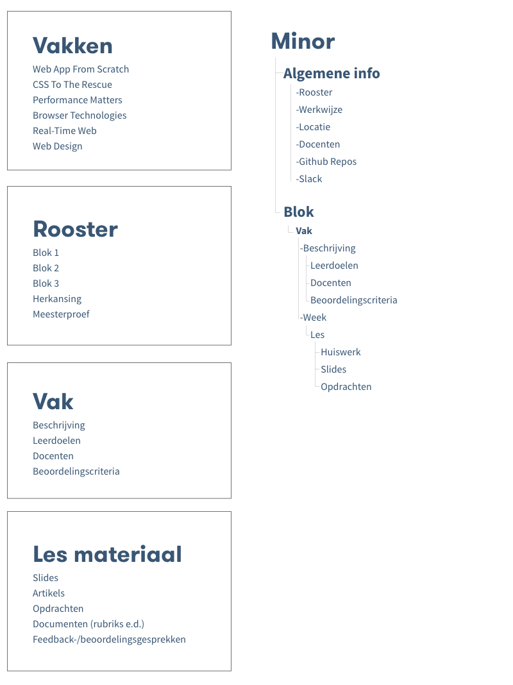

# Web Design

De opdracht voor het vak Web Design is om een ontwerp te maken, waarin [User Interface Principles](http://bokardo.com/principles-of-user-interface-design/) zijn toegepast en User needs worden bahaald.

De case die ik heb gekozen is een leeromgeving voor de minor. 

[Demo](http://viennam.github.io/web-design/dist)

## Content
Wat heb ik allemaal (nodig)?

## User Scenario's

### Marie
Marie volgt de minor web development en wil in één oogopslag een duidelijk overzicht van het juiste lesmateriaal, zodat ze geen lange lappen tekst hoeft door te lezen.

**Doel:** Een interface met heldere navigatie en hiërarchie.

### Student CMD
Een student van de minor web development wil een omgeving waarin hij alles kan vinden wat hij tijdens de minor nodig heeft. Daarnaast wil hij zijn voortgang kunnen bijhouden.

**Doel:** Interactieve elementen om voortgang bij te kunnen houden.

## Interface Principes
Bij het ontwerpen van de interface heb ik een aantal principes toegepast.

### 1. Conserve attention at all costs
De zijbalk is te verbergen om de aandacht te richten op de huidige pagina. 

### 2. Strong visual hierarchies work best
Met behulp van een grote titel weet je direct op welke pagina je bent.

## Bronnen

[http://bokardo.com/principles-of-user-interface-design/](http://bokardo.com/principles-of-user-interface-design/)