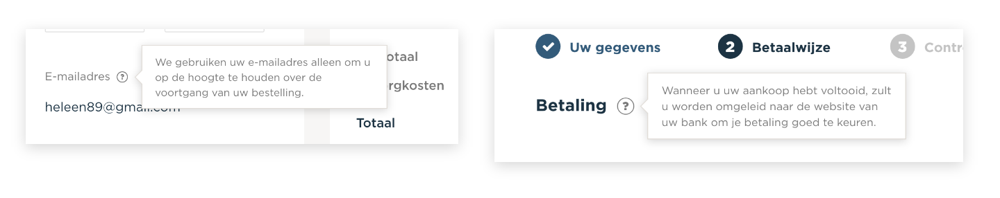

# Spa webshop

Een user interface voor de use case: 'Ik wil artikelen in mijn winkelmandje kunnnen bekijken, uit de lijst verwijderen, en de rest afrekenen.'

[Design demo](https://xd.adobe.com/view/8465b814-17f3-4a55-4cb4-d8bcf9e51e1f-f254/?fullscreen&hints=off)

[HTML demo](https://viennam.github.io/web-design/opdracht1/prod/index.html/)

## User interface principes

### 1. Provide a natural next step

Ik bied een heldere volgende stap aan die de gebruiker helpt om zo makkelijk mogelijk af te kunnen rekenen. Dit doe ik met behulp van één focal point als button per scherm, met een duidelijke call to action.

### 2. Smart organization reduces cognitive load / Progressive disclosure

Om de gebruiker zo min mogelijk te belasten, deel ik het bestelproces op in 3 onderdelen. Dit zorgt ervoor dat er niet te veel informatie in 1 keer wordt aangeboden.

### 3. Help people inline

Alleen waar en wanneer het nodig is help ik gebruikers en geef antwoord op hun vragen. Niet aan gebruikers die al weten hoe iets moet. 

## Iteraties

### Afrekenproces

De eerste grote iteratie die voortkomt uit feedback is de verdeling van de in te vullen gegevens om te bestellen. In de eerste versie had ik deze allemaal bij elkaar gezet. In versie 2 heb ik rekening gehouden met de principes Smart organization reduces cognitive load & Progressive disclosure.

### Navigatie

Uit het feedback gesprek bleek dat het geen goed idee is om de navigatie te verbergen tijdens het afrekenproces. Het zou namelijk frustrerend kunnen werken voor de gebruiker, als hij bijvoorbeeld toch nog iets wil toevoegen aan zijn winkelmandje. Ook gaat dit tegen het principe in van Keep users in control.

### Volgorde gegevens

Ook kwam ik tot de conclusie dat de volgorde van het proces beter kan. Wanneer je eerst je betaalwijze kiest, zou het kunnen dat adres- en contactgegevens automatisch ingevuld worden. Bijvoorbeeld met PayPal of een credit card account.

Deze feedback heb ik echter nog niet verwerkt. Het is wel iets om rekening mee te houden in de toekomst.

## To do
- Proces beter uitdenken.
- Contrast verhogen op sommige plekken.

## Bronnen
- [http://bokardo.com/principles-of-user-interface-design/](http://bokardo.com/principles-of-user-interface-design/)
